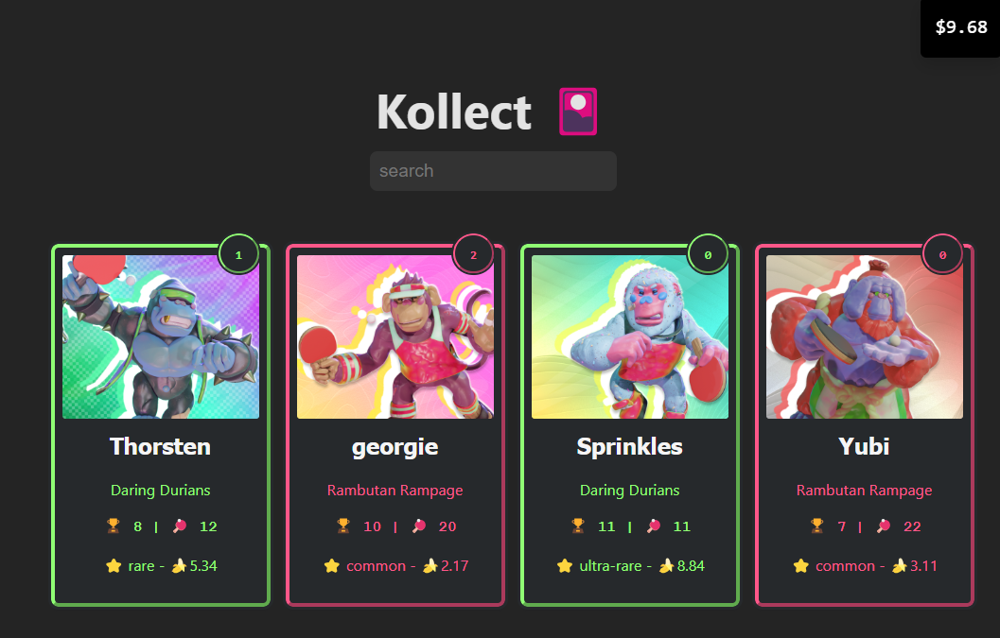

# Kollect 🎴

In this lecture we will build an app based around browsing and collecting virtual trading cards. This is an example of a react application that uses the CodeWorks (🍌 PEEL League) data. 

## Application Features

- Building a multi-component React app.
- Iterating over a collection of cards to and displaying their information to the page.
- Reactive rendering of the card display with filters or sorts with useState.
- Event handling for clicking on cards to "collect" them.